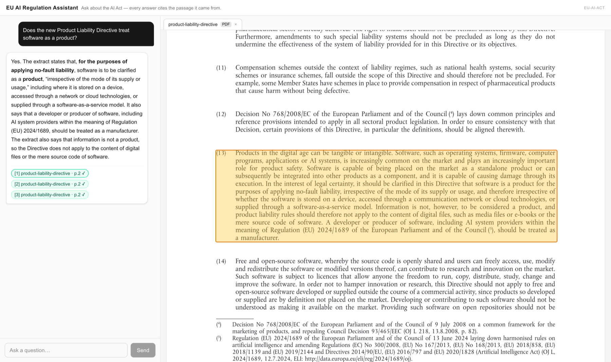
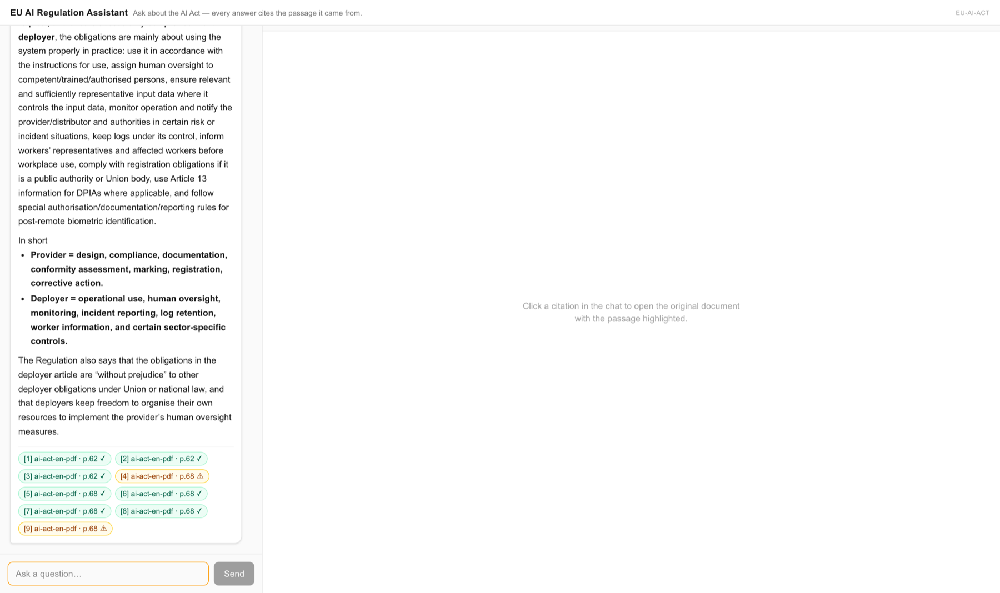

# Document Assistant

Grounded question answering over a document corpus, where **every claim points
back to the exact passage it came from** — the page and bounding box in the
original PDF, or the highlighted span in the original HTML.

A reference implementation, not a library: clone it, swap the domain pack,
point it at your documents. The demo corpus is EU AI regulation.



*The footnote number sits on the sentence it supports. Clicking it — or its entry
in the reference list — opens the original Official Journal PDF and highlights
the exact passage the claim came from. Green passed quote verification against
the stored source text; amber did not.*



*The same contract on a long answer. Numbers are assigned in the order the
reader meets them, and the reference list is ordered to match — so a claim near
the end still resolves to one entry rather than to a list of file names.*

## Why this exists

Most RAG demos answer with a footnote listing which document they used. That is
not verification, it is a citation-shaped object. Three things are different
here:

**The citation contract is load-bearing.** Every answer emits
`{doc_id, title, marker, page, bbox, chunk_text, quote}`, and each quote is then
checked against the stored chunk text. Citations that fail come back
`verified: false` and render differently. A model that paraphrases its own
source gets caught.

**Claims are cited where they are made.** The model marks each sentence with the
chunk it rests on; the backend turns those marks into footnote numbers, in order
of first appearance, and orders the reference list to match. In a long answer —
an obligation matrix, a penalty table — every row carries the number of the
provision it came from, instead of a train of file names at the end that fits no
particular sentence.

**The viewer shows the original artifact, not a reconstruction.** PDFs are drawn
by PDF.js with overlays on the stored bounding boxes; HTML and DOCX originals
are served exactly as captured, inside a sandboxed iframe that cannot run
scripts, and highlighted through the CSS Custom Highlight API.

**Two paths, and the routing is measured.** Simple lookups go to hybrid
retrieval. Questions that need navigation — comparing regimes, following a
cross-reference into another act, reading an annex — go to an agent that opens
documents. The evaluation set records which path each question *should* get, so
the router is a number rather than an opinion.

That third one is not theoretical. Asked for the maximum fine for a prohibited
AI practice, the retrieval path found Article 100 — the same conduct, but for
Union institutions — and answered EUR 1 500 000. The agent path opened Article
99 and answered EUR 35 000 000 or 7% of worldwide turnover. Both answers cited
faithfully. The difference was in what reached the model.

## How it works

```
ingest  → parse (Docling: text, page, bounding box)
        → tables extracted as their own artifacts
        → chunk (content-derived ids, stable across re-ingestion)
        → embed → pgvector
        → materialize a filesystem workspace (sections, tables, index)
        → publication gate: queryable only when the whole pipeline succeeded

query   → condense follow-ups into a standalone question
        → route
        → RAG:   hybrid search (vector + full-text, fused with RRF) → grounded answer
          agent: search, open sections, follow cross-references, then answer
        → verify every quote against its chunk
        → stream tokens, activity and citations over SSE
```

Orchestration is one compiled LangGraph `StateGraph`
([diagram](docs/graph.mmd)). LangGraph owns orchestration and nothing else:
retrieval, citation verification, chunking and the workspace are plain Python.
Storage is split three ways — Postgres for chunks and provenance, object storage
for untouched originals, and a regenerable filesystem workspace the agent
navigates.

More in [docs/architecture.md](docs/architecture.md).

## Quickstart

```bash
cp .env.example .env                                       # add OPENAI_API_KEY
docker compose up -d                                       # Postgres + pgvector, API on :8000

docker compose run --rm ingest python -m corpus sync       # fetch the demo corpus
docker compose run --rm ingest python -m ingestion ingest   # parse, chunk, embed, publish

cd frontend && npm install && npm run dev                  # UI on :3000
```

Parsing runs in a separate image on purpose: it pulls in torch and OpenCV, which
the request path never imports. Keeping them apart is the difference between a
~200 MB API image and a ~2 GB one.

Later, when the regulation moves:

```bash
docker compose run --rm ingest python -m corpus sync --check   # what changed upstream
```

## Domain packs

Nothing under `backend/app/` contains a domain string — not a prompt, not a
routing rule, not the title in the browser tab. All of it is data:

```
packs/eu-ai-act/
  pack.yaml         identity, UI copy, fixed replies, evaluation topics
  prompts/          answer, condense, router, summarize, agent
  router.yaml       regex signals that bypass the classifier
  sources.yaml      where the corpus comes from, and under what terms
  benchmark.jsonl   evaluation scenarios
```

Point `PACK_DIR` elsewhere and the system retargets, UI included — it reads its
copy from `GET /api/pack`. See [docs/domain-packs.md](docs/domain-packs.md).

## Evaluation

`benchmark/run.py` replays scenarios through the same HTTP endpoint the web app
uses, so what gets measured is what ships. It scores nothing and calls no second
model: it saves transcripts, and a reviewer reads them against the rubric and
the sources. An LLM judge would add a second thing that can be wrong in the one
place that has to be trustworthy.

```bash
python3 benchmark/run.py --validate-only
python3 benchmark/run.py --backend-url http://localhost:8000/api/chat
python3 benchmark/report.py benchmark/results/<file>.json
```

First measured run — 40 scenarios, 16 documents, 2026-08-09:

| | |
|---|---|
| Content | 31 complete · 5 partial · 4 wrong |
| Quotes verified against source | 204 / 216 (94%) |
| `must_cite` satisfied | 36 / 38 |
| Routing vs `expected_path` | 30 / 40 |
| Latency | median 8.1 s, max 81.7 s |

Split by the path each question actually took, the agent path answered **20 of
20 completely**, and every failure in the run is on the retrieval path — and
every one of those is a *retrieval* failure, not a generation failure: the fact
is in the corpus and the answer was faithful to the extracts it was given.
Nothing has been tuned in response yet; these are baseline numbers with the
diagnosis written down. Full review in
[docs/evaluation.md](docs/evaluation.md).

Scenarios are never edited to make transcripts look better. A benchmark that
moves toward the system it measures is decoration.

## The demo corpus

Public EU AI regulation: the AI Act in English and Italian and as the Official
Journal PDF, the acts it cross-references (GDPR, Data Act, DSA, Machinery
Regulation, Product Liability Directive, NIS2, Cyber Resilience Act), and NIST's
AI risk frameworks as a non-EU contrast.

Documents are **not redistributed here**. `python -m corpus sync` fetches them
from their publishers, and `packs/eu-ai-act/sources.yaml` records the reuse
terms of each — EUR-Lex under Decision 2011/833/EU, NIST as US government work.
ISO standards are deliberately excluded: they are not freely redistributable.

**This is a technical demonstration, not legal advice.** The corpus is a dated
snapshot; regulation changes, which is exactly why the fetcher exists.

## Stack

Python · FastAPI · Postgres + pgvector · Docling · LangGraph · Next.js +
react-pdf · OpenAI for embeddings and generation, configurable per task.
Tracing through Langfuse is opt-in and off by default — a public reference
implementation should not require an account with anyone to run.

## Not here yet

Persisted sessions and memory, retrieval-level permissions and multi-tenancy,
WhatsApp, CRM integration, audio. All additive. Multi-turn conversation works
today by sending history with the request.

## License

MIT for the code. The demo corpus keeps the terms of its sources — see
[LICENSE](LICENSE).
