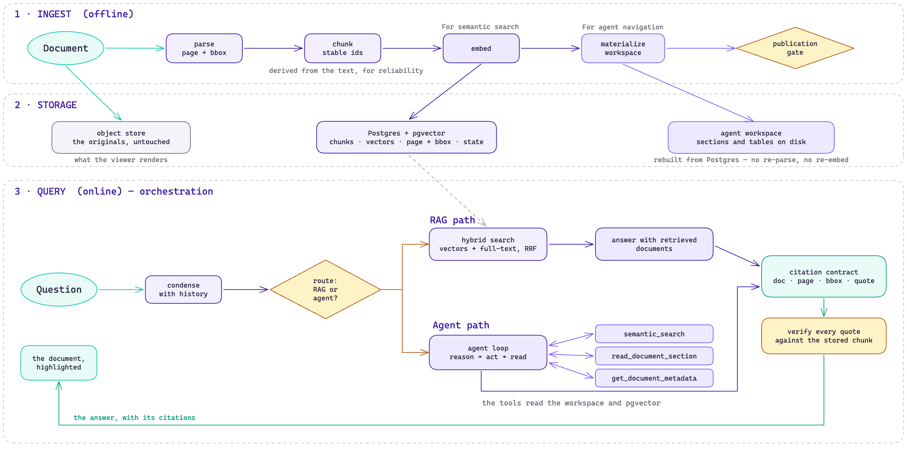

# Architecture



Three stages: documents come in once, they are stored three ways, and questions
are answered along one of two paths. Everything the reader eventually checks — a
page number, a bounding box, a quote — is decided in the first stage.

## Ingestion

`data/raw/` is the inbox and the only input. `make ingest` drains it, one file at
a time, and a document that fails does not stop the rest.

**Parse.** [Docling](https://github.com/docling-project/docling) reads PDF, HTML and DOCX into one structured document with layout preserved: headings, tables, and for PDFs the page and bounding box of every element. That geometry is what later lets the UI open the original and highlight the passage, so it is worth the heavy dependency. HTML gets a cleaning pass first, and if the markup defeats Docling the text is re-extracted as a flat projection rather than lost.

**Chunk.** Text is grouped under its headings, split at a token budget, and
tables are kept whole. Each chunk gets an id derived from its own content:

```
chunk_id = "<doc_id>#" + sha256(kind + text)[:16]
```

Content-derived, not positional. Re-parse a document and the ids come back
identical, so a citation written last week still points at the same sentence.
`python -m ingestion check-stability <doc_id>` re-parses a published document and
compares the ids as a check.

**Embed.** One vector per chunk, into pgvector.

**Summarize.** One model call per document produces a summary and a one-line
gloss. The gloss is the document's line in the index the agent reads before
deciding what to open — a corpus ingested without glosses is a corpus the agent
opens at random, which is why this happens during ingestion and not in a separate
pass you have to remember.

**Publish.** The chunks are written in a transaction, the document is marked
`PUBLISHED`, and the original file moves to the object store.

## Storage

The same corpus is kept three ways because three different consumers need
different things from it.

**Postgres + pgvector** holds the chunks: text, vector, page, bounding box, and
document state. It is the source of truth. The schema is
[one file](../engine/backend/db/schema.sql), applied at startup — no ORM, no
migration tool, because a local reference application does not upgrade in place.

**The object store** (`data/objects/`) holds the originals, untouched. It is what
the viewer renders when you click a citation.

**The agent workspace** (`data/workspace/`) is a filesystem projection: one
directory per document, holding the full extraction, the summary, the tables, and
the text split into readable sections with chunk ids inlined as HTML comments.
It is fully regenerable from Postgres (`make rebuild`) and never the source of
truth. It exists because the agent path navigates by reading — and because a
human can open it and see exactly what the agent sees.

## Query

**Condense.** The question is rewritten against the conversation into something
standalone, so retrieval never depends on "it" or "that article".

**Route.** Optional regexes in `config/routing.yaml` get first say; anything they
do not claim goes to a small classifier. Two outcomes:

**The RAG path** — for questions whose answer sits in one place. Vector search
and Postgres full-text search each return a ranked pool, the two rankings are
fused with reciprocal rank fusion, and the top chunks go to the model. Hybrid
rather than pure vector because exact strings — an article number, a threshold,
a part code — are as important as similarity in technical corpora, and embeddings
are bad at them.

**The agent path** — for questions that need several documents, a table, or a
cross-reference. The model works with three tools:

| | |
|---|---|
| `semantic_search` | the same hybrid retrieval, as a tool |
| `get_document_metadata` | what a document contains and how it is divided |
| `read_document_section` | the full text of one section, chunk ids included |

It reasons, reads, and reads again, under a tool budget. Past a soft cap the
tools start asking it to conclude; past a hard cap the run is stopped and the
question falls back to the RAG path rather than failing.

Both paths are a [LangGraph](https://github.com/langchain-ai/langgraph) state graph with real branching, retries and fallbacks — [`app/graph.py`](../engine/backend/app/graph.py).

## The citation contract

This is the part everything else exists to serve.

The model marks each claim in its prose with the id of the chunk supporting it,
and separately returns a JSON array repeating each reference with the exact
sentence it relied on. Then the backend:

1. **drops** any citation pointing at a chunk the model was not actually shown;
2. **checks** the quote appears in that chunk's stored text, comparing on word
   characters only so punctuation and whitespace cannot cause a false negative;
3. **numbers** the surviving references in order of first appearance, so the
   reader sees footnotes and never a raw id;
4. **attaches** the page and bounding box, which is what lets the viewer open the
   original scrolled to the passage with the region highlighted.

A reference whose citation did not survive is stripped rather than left pointing
at nothing. The check is mechanical: it proves the quote is really in the source,
not that the source supports the claim. That distinction is the honest limit of
the feature.

## Configuration

The engine carries the prompts, including the citation protocol above — the
format is a contract with the code that parses it, so a misconfigured deployment
cannot silently break provenance.

What a deployment legitimately changes is `config/identity.md`, prose describing
who the assistant is, injected at the top of every prompt. Plus optional UI copy
and routing shortcuts. See [setup](setup.md); the loader is
[`app/assistant.py`](../engine/backend/app/assistant.py).

## Layout

```
config/          identity.md, assistant.yaml, routing.yaml — all optional
data/raw/        the only input
data/objects/    the originals
data/workspace/  the agent's reading surface, regenerable
engine/backend/  API, retrieval, graph, prompts, ingestion
engine/frontend/ Next.js UI: chat, PDF and HTML viewers, highlighting
engine/benchmark/ the evaluation harness
example/         the demo corpus and its configuration — not part of the system
```
